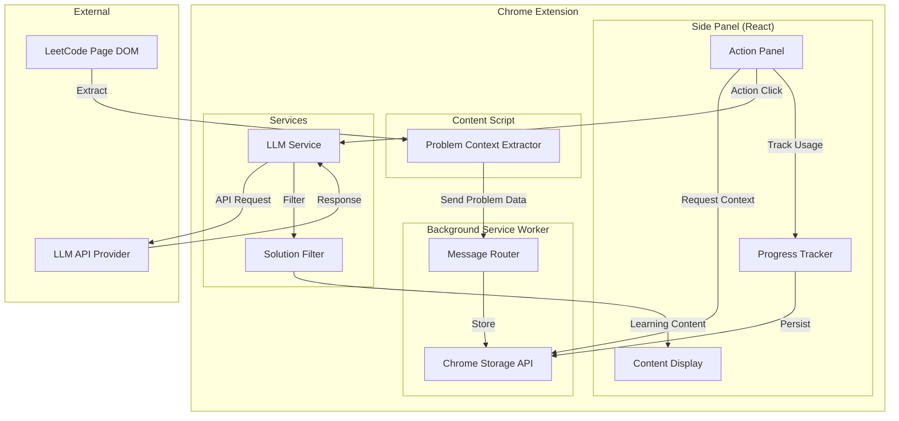

# Design Document: AI Learning Assistant

## Overview

The AI Learning Assistant transforms the LeetSage Chrome extension into an interactive learning companion by providing immediate, action-driven access to AI-powered learning aids. The design centers on an action-button-first UI paradigm where users click prominent buttons to instantly receive hints, examples, problem breakdowns, and other learning content without typing queries.

### Core Design Principles

1. **Action-First Interaction**: Prominent action buttons replace traditional chat input as the primary interface
2. **Progressive Disclosure**: Learning content is revealed incrementally to maintain educational value
3. **Solution Prevention**: Architectural safeguards prevent complete solution disclosure
4. **Context-Aware Assistance**: All AI responses are grounded in extracted problem context
5. **Engaging Experience**: Visual design and language create an encouraging learning environment

### Key Components

- **Action Panel UI**: React-based side panel with prominent action buttons
- **Problem Context Extractor**: Content script that extracts LeetCode problem data
- **LLM Integration Layer**: Service for communicating with external language models
- **Solution Filter**: Response processing layer that prevents complete solutions
- **Progress Tracker**: State management for tracking user interactions per problem
- **Content Renderer**: Component for displaying formatted learning content

## Architecture

### System Architecture

The system follows a Chrome Extension Manifest V3 architecture with clear separation between UI, content extraction, background processing, and external API communication.



### Component Interaction Flow

1. **Problem Detection**: Content script extracts problem data from LeetCode DOM
2. **Context Storage**: Background worker stores problem context in Chrome storage
3. **User Action**: User clicks action button in side panel
4. **Context Retrieval**: Action panel retrieves problem context from storage
5. **LLM Request**: Service sends problem context + action type to LLM API
6. **Response Filtering**: Solution filter processes LLM response
7. **Content Display**: Filtered content is rendered in the content display area
8. **Progress Update**: Progress tracker records the action usage

### Technology Stack Integration

- **React 19.1.1**: Component-based UI with hooks for state management
- **TypeScript 5.8.3**: Type-safe development across all components
- **Tailwind CSS 4.1.12**: Utility-first styling for action buttons and content cards
- **Vite 7.1.2**: Build tool for bundling extension assets
- **Chrome Extension APIs**: Storage, messaging, side panel, content scripts

## Components and Interfaces

### 1. Action Panel Component

**Responsibility**: Primary UI component displaying action buttons and managing user interactions.

**Interface**:
```typescript
interface ActionPanelProps {
  problemContext: ProblemContext | null;
  onActionClick: (actionType: ActionType) => void;
  progress: ProgressState;
  apiKeyConfigured: boolean;
}

type ActionType = 
  | 'GET_HINT'
  | 'GENERATE_EXAMPLES'
  | 'BREAK_DOWN_PROBLEM'
  | 'EXPLAIN_CONCEPT'
  | 'CHECK_APPROACH'
  | 'TIME_COMPLEXITY_HINT'
  | 'PATTERN_RECOGNITION';

interface ActionButton {
  type: ActionType;
  label: string;
  icon: string;
  description: string;
  used: boolean;
}
```

**Key Features**:
- Displays problem title and difficulty badge at top
- Renders grid of action buttons with icons and labels
- Shows visual indicators (checkmarks) for used actions
- Provides settings icon for API key configuration
- Displays welcome message on first load
- Includes "Reset Progress" button

### 2. Problem Context Extractor

**Responsibility**: Extracts structured problem data from LeetCode DOM.

**Interface**:
```typescript
interface ProblemContext {
  title: string;
  url: string;
  difficulty: 'Easy' | 'Medium' | 'Hard';
  description: string;
  examples: Example[];
  constraints: string[];
  testCases: TestCase[];
  extractedAt: number;
}

interface Example {
  input: string;
  output: string;
  explanation?: string;
}

interface TestCase {
  input: string;
  expectedOutput: string;
}
```

**Extraction Strategy**:
- Use MutationObserver to detect problem page navigation
- Query specific DOM selectors for problem elements
- Parse code blocks for examples and test cases
- Extract constraints from problem description
- Handle dynamic content loading with retry logic
- Send extracted data to background worker via chrome.runtime.sendMessage

**DOM Selectors** (based on LeetCode structure):
- Problem title: `a[href^="/problems/"]` with number prefix pattern
- Difficulty: `div.text-difficulty-easy`, `div.text-difficulty-medium`, `div.text-difficulty-hard`
- Description: Main content area (requires parsing)
- Examples: Pre-formatted code blocks within description
- Constraints: List items in constraints section

### 3. LLM Service

**Responsibility**: Manages communication with external LLM API provider.

**Interface**:
```typescript
interface LLMService {
  sendRequest(request: LLMRequest): Promise<LLMResponse>;
  streamRequest(request: LLMRequest): AsyncGenerator<string>;
}

interface LLMRequest {
  problemContext: ProblemContext;
  actionType: ActionType;
  systemPrompt: string;
  userMessage: string;
  apiKey: string;
  previousHintLevel?: number;
  userApproach?: string; // For CHECK_APPROACH action
}

interface LLMResponse {
  content: string;
  finishReason: 'stop' | 'length' | 'content_filter';
  usage?: {
    promptTokens: number;
    completionTokens: number;
  };
}
```

**Implementation Details**:
- Support for OpenAI API format (adaptable to other providers)
- Streaming response support for improved UX
- Error handling with retry logic
- Request timeout configuration (30 seconds)
- Token usage tracking for user awareness

**System Prompts by Action Type**:
Each action type has a specialized system prompt that:
- Defines the learning-focused role
- Specifies the output format
- Enforces solution prevention rules
- Sets the tone (encouraging, supportive)

### 4. Solution Filter

**Responsibility**: Post-processes LLM responses to prevent complete solution disclosure.

**Interface**:
```typescript
interface SolutionFilter {
  filterResponse(response: string, actionType: ActionType): FilterResult;
}

interface FilterResult {
  filteredContent: string;
  wasFiltered: boolean;
  filterReason?: string;
}
```

**Filtering Rules**:
1. **Complete Code Detection**: Identify responses containing full function implementations
2. **Pattern Matching**: Detect common solution patterns (e.g., complete algorithm implementations)
3. **Length Heuristics**: Flag responses with code blocks exceeding threshold (e.g., >20 lines)
4. **Keyword Detection**: Identify phrases like "here's the complete solution", "full implementation"
5. **Pseudocode Allowance**: Permit high-level pseudocode without language-specific syntax
6. **Snippet Allowance**: Allow short code snippets (<10 lines) demonstrating specific concepts

**Filter Actions**:
- If complete solution detected: Replace with guidance message
- If borderline: Add warning banner about maintaining learning value
- If acceptable: Pass through unchanged
- Log all filter activations for monitoring

### 5. Content Display Component

**Responsibility**: Renders formatted learning content with interactive elements.

**Interface**:
```typescript
interface ContentDisplayProps {
  content: LearningContent[];
  isLoading: boolean;
  onExpandToggle: (contentId: string) => void;
}

interface LearningContent {
  id: string;
  type: ContentType;
  actionType: ActionType;
  content: string;
  timestamp: number;
  expanded: boolean;
  metadata?: ContentMetadata;
}

type ContentType = 
  | 'HINT'
  | 'EXAMPLES'
  | 'BREAKDOWN'
  | 'EXPLANATION'
  | 'FEEDBACK'
  | 'CHAT_MESSAGE';

interface ContentMetadata {
  hintLevel?: number;
  exampleComplexity?: 'Simple' | 'Medium' | 'Tricky';
  subProblems?: SubProblem[];
}

interface SubProblem {
  title: string;
  description: string;
  relevantConcepts: string[];
  expanded: boolean;
}
```

**Rendering Features**:
- Markdown parsing and rendering (bold, italic, lists, code blocks)
- Syntax highlighting for code snippets
- Expandable/collapsible cards for each content piece
- Visual distinction between content types (color coding, icons)
- Auto-scroll to newly generated content
- Loading indicators with animated skeleton screens
- Side-by-side comparison view for examples

### 6. Progress Tracker

**Responsibility**: Tracks which learning aids have been used per problem.

**Interface**:
```typescript
interface ProgressTracker {
  trackAction(problemUrl: string, actionType: ActionType): void;
  getProgress(problemUrl: string): ProgressState;
  resetProgress(problemUrl: string): void;
}

interface ProgressState {
  problemUrl: string;
  usedActions: Set<ActionType>;
  hintLevel: number;
  contentHistory: LearningContent[];
  lastUpdated: number;
}
```

**Storage Strategy**:
- Use Chrome Storage API (chrome.storage.local)
- Key format: `progress_${problemUrl}`
- Persist on every action
- Load on component mount
- Clear on reset button click

### 7. Hint System Component

**Responsibility**: Manages progressive hint generation with level tracking.

**Interface**:
```typescript
interface HintSystem {
  generateHint(problemContext: ProblemContext, currentLevel: number): Promise<Hint>;
  getMaxHintLevel(): number;
}

interface Hint {
  level: number;
  title: string;
  content: string;
  isLastHint: boolean;
}
```

**Hint Level Definitions**:
1. **Level 1 - Conceptual**: High-level approach, relevant data structures
2. **Level 2 - Approach-Oriented**: Step-by-step strategy, algorithm choice
3. **Level 3 - Implementation-Focused**: Specific techniques, edge case handling

**Progressive Disclosure**:
- Each hint builds on previous hints
- Previous hints remain visible in collapsed cards
- Clear visual indicators for hint levels
- "No more hints" message after level 3

### 8. Example Generator Component

**Responsibility**: Creates alternative test cases with complexity indicators.

**Interface**:
```typescript
interface ExampleGenerator {
  generateExamples(problemContext: ProblemContext): Promise<GeneratedExamples>;
}

interface GeneratedExamples {
  examples: GeneratedExample[];
  comparisonView: ComparisonData;
}

interface GeneratedExample {
  input: string;
  output: string;
  complexity: 'Simple' | 'Medium' | 'Tricky';
  explanation: string;
  edgeCaseType?: string;
}

interface ComparisonData {
  originalExamples: Example[];
  generatedExamples: GeneratedExample[];
  coverageAnalysis: string;
}
```

**Generation Strategy**:
- Analyze original examples to identify gaps
- Generate at least 2 new examples
- Ensure constraint compliance
- Label complexity based on input characteristics
- Explain educational value of each example

### 9. Breakdown Engine Component

**Responsibility**: Decomposes problems into logical sub-problems.

**Interface**:
```typescript
interface BreakdownEngine {
  breakdownProblem(problemContext: ProblemContext): Promise<ProblemBreakdown>;
}

interface ProblemBreakdown {
  subProblems: SubProblem[];
  visualizationType: 'checklist' | 'flowchart';
  overallStrategy: string;
}

interface SubProblem {
  id: string;
  title: string;
  description: string;
  relevantConcepts: string[];
  suggestedDataStructures: string[];
  expanded: boolean;
}
```

**Breakdown Approach**:
- Generate 3-5 logical sub-problems
- Present as interactive checklist or flowchart
- Avoid implementation code
- Suggest relevant data structures/algorithms
- Allow expansion for detailed explanations

### 10. Chat Mode Component (Optional)

**Responsibility**: Provides free-form question interface as secondary feature.

**Interface**:
```typescript
interface ChatModeProps {
  problemContext: ProblemContext;
  onSendMessage: (message: string) => void;
  messages: ChatMessage[];
  isActive: boolean;
}

interface ChatMessage {
  id: string;
  role: 'user' | 'assistant';
  content: string;
  timestamp: number;
}
```

**Design Considerations**:
- Visually secondary to action buttons
- Toggle button to activate/deactivate
- Compact message display
- Same solution filter rules apply
- Clear visual distinction from action-generated content

### 11. Stuck Timer Component

**Responsibility**: Detects inactivity and suggests learning aids proactively.

**Interface**:
```typescript
interface StuckTimer {
  startTimer(problemUrl: string): void;
  stopTimer(): void;
  onSuggestion: (suggestion: StuckSuggestion) => void;
}

interface StuckSuggestion {
  message: string;
  suggestedAction: ActionType;
  canDismiss: boolean;
}
```

**Timer Logic**:
- Start timer when problem page loads
- Reset timer on any action button click
- Trigger suggestion after 5 minutes of inactivity
- Cooldown period of 10 minutes between suggestions
- Respect user preference to disable suggestions
- Suggest action based on problem difficulty and progress

## Data Models

### Core Data Structures

```typescript
// Problem Context Model
interface ProblemContext {
  title: string;
  url: string;
  difficulty: 'Easy' | 'Medium' | 'Hard';
  description: string;
  examples: Example[];
  constraints: string[];
  testCases: TestCase[];
  extractedAt: number;
}

// Learning Content Model
interface LearningContent {
  id: string;
  type: ContentType;
  actionType: ActionType;
  content: string;
  timestamp: number;
  expanded: boolean;
  metadata?: ContentMetadata;
}

// Progress State Model
interface ProgressState {
  problemUrl: string;
  usedActions: Set<ActionType>;
  hintLevel: number;
  contentHistory: LearningContent[];
  lastUpdated: number;
}

// API Configuration Model
interface APIConfig {
  provider: 'openai' | 'anthropic' | 'custom';
  apiKey: string;
  baseUrl?: string;
  model?: string;
}

// User Settings Model
interface UserSettings {
  apiConfig: APIConfig;
  enableStuckTimer: boolean;
  stuckTimerDelay: number; // milliseconds
  enableChatMode: boolean;
  theme: 'light' | 'dark' | 'auto';
}
```

### Storage Schema

**Chrome Storage Local**:
```typescript
{
  // Current problem context
  "problemData": ProblemContext,
  
  // Progress per problem (keyed by URL)
  "progress_https://leetcode.com/problems/two-sum/": ProgressState,
  "progress_https://leetcode.com/problems/add-two-numbers/": ProgressState,
  
  // User configuration
  "userSettings": UserSettings,
  
  // Stuck timer state
  "stuckTimerState": {
    "lastSuggestionTime": number,
    "currentProblemUrl": string
  }
}
```

### Message Passing Schema

**Content Script → Background Worker**:
```typescript
{
  type: "PROBLEM_DATA",
  payload: ProblemContext
}
```

**Side Panel → Background Worker**:
```typescript
{
  type: "GET_PROBLEM_DATA",
  payload: { url: string }
}

{
  type: "TRACK_ACTION",
  payload: {
    problemUrl: string,
    actionType: ActionType,
    timestamp: number
  }
}
```

**Background Worker → Side Panel**:
```typescript
{
  type: "PROBLEM_DATA_RESPONSE",
  payload: ProblemContext | null
}
```

### State Management

**React State Structure**:
```typescript
// Main App State
interface AppState {
  problemContext: ProblemContext | null;
  progress: ProgressState;
  learningContent: LearningContent[];
  isLoading: boolean;
  error: string | null;
  apiKeyConfigured: boolean;
  chatModeActive: boolean;
  settings: UserSettings;
}

// Action Panel State
interface ActionPanelState {
  expandedContent: Set<string>;
  showSettings: boolean;
  stuckSuggestion: StuckSuggestion | null;
}
```


## Correctness Properties

*A property is a characteristic or behavior that should hold true across all valid executions of a system—essentially, a formal statement about what the system should do. Properties serve as the bridge between human-readable specifications and machine-verifiable correctness guarantees.*

### Property 1: Problem Context Completeness

*For any* valid LeetCode problem page, the Problem Context Extractor should extract all required fields (title, url, difficulty, description, examples, constraints, and test cases) and return a complete ProblemContext object with no null or undefined required fields.

**Validates: Requirements 2.1, 2.2**

### Property 2: Problem Context Updates on Change

*For any* problem page where the DOM content changes, the Problem Context Extractor should detect the change and re-extract the problem data, resulting in updated storage with the new extraction timestamp.

**Validates: Requirements 2.3**

### Property 3: LLM Requests Include Problem Context

*For any* action button click that triggers an LLM request, the request payload should include the complete problem context extracted from the current problem page.

**Validates: Requirements 2.4, 7.2**

### Property 4: Generated Examples Structure

*For any* problem context, when the Example Generator creates alternative test cases, it should return at least 2 examples where each example has an input, output, complexity indicator (Simple/Medium/Tricky), and a non-empty explanation.

**Validates: Requirements 3.1, 3.2, 3.4**

### Property 5: Problem Breakdown Structure

*For any* problem context, when the Breakdown Engine decomposes the problem, it should return between 3 and 5 sub-problems where each sub-problem has a title, description, and list of relevant concepts or suggested data structures.

**Validates: Requirements 4.1, 4.3, 4.4**

### Property 6: Breakdown Avoids Implementation Code

*For any* generated problem breakdown, the sub-problem descriptions should not contain complete code implementations (defined as code blocks with function definitions and return statements).

**Validates: Requirements 4.5**

### Property 7: Hint Level Progression

*For any* problem context, when a user requests hints sequentially, the Hint System should provide hints at levels 1, 2, then 3 in order, and each hint should have a unique level number with previous hints remaining accessible.

**Validates: Requirements 5.1, 5.4**

### Property 8: Hint Display with Level Indicators

*For any* generated hint, when rendered in the Content Display, the output should include a visible level indicator (e.g., "Hint 1", "Hint 2", "Hint 3").

**Validates: Requirements 5.3**

### Property 9: Solution Filter Prevents Complete Solutions

*For any* LLM response containing a complete working code solution (defined as a code block with a complete function implementation including all logic and return statements), the Solution Filter should modify the response to remove or replace the complete solution with guidance text.

**Validates: Requirements 6.1, 6.3**

### Property 10: Solution Filter Allows Snippets and Pseudocode

*For any* LLM response containing code snippets under 10 lines or pseudocode without language-specific syntax, the Solution Filter should allow the content to pass through unchanged.

**Validates: Requirements 6.2, 6.4**

### Property 11: Solution Filter Allows Code Review

*For any* LLM response generated from a CHECK_APPROACH action type, the Solution Filter should allow code review and feedback content even if it references user-submitted code.

**Validates: Requirements 6.5**

### Property 12: LLM Requests Include System Prompts

*For any* action type, when constructing an LLM request, the request should include a system prompt that defines the learning-focused role and solution prevention rules.

**Validates: Requirements 7.6**

### Property 13: LLM Response Parsing

*For any* successful LLM API response, the AI Assistant should parse the response content and convert it into a LearningContent object with the appropriate type, action type, and timestamp.

**Validates: Requirements 7.3**

### Property 14: Progress Tracking Per Action

*For any* action button click on a problem page, the Progress Tracker should add that action type to the set of used actions for that specific problem URL.

**Validates: Requirements 8.1**

### Property 15: Progress Visual Indicators

*For any* action type that has been used (present in the progress state's usedActions set), the corresponding action button in the UI should display a visual indicator (checkmark or badge).

**Validates: Requirements 8.2**

### Property 16: Progress Isolation by Problem

*For any* two different problem URLs, the progress state for problem A should be independent from the progress state for problem B, such that actions tracked for one problem do not appear in the other's progress.

**Validates: Requirements 8.3**

### Property 17: Progress Persistence Round-Trip

*For any* problem URL with tracked progress, if the user navigates away and then returns to the same problem URL, the Progress Tracker should restore the exact same progress state (same usedActions set and hintLevel).

**Validates: Requirements 8.4**

### Property 18: Content Type Visual Differentiation

*For any* two learning content items with different content types (e.g., HINT vs EXAMPLES), the rendered output should have distinct visual styling (different CSS classes, colors, or icons).

**Validates: Requirements 9.4**

### Property 19: Action Content Display Location

*For any* action button click that generates learning content, the new content should appear in the Content Display area below the action buttons in the component hierarchy.

**Validates: Requirements 10.5**

### Property 20: API Key Format Validation

*For any* API key input, if the format does not match the expected pattern for the selected provider (e.g., OpenAI keys start with "sk-"), the validation should reject the input and prevent saving.

**Validates: Requirements 11.4**

### Property 21: Markdown Rendering Completeness

*For any* learning content containing markdown syntax (bold, italic, lists, code blocks), the Content Display should render the content with proper HTML formatting where markdown syntax is converted to corresponding HTML elements.

**Validates: Requirements 12.1, 12.3**

### Property 22: Chat Mode Solution Filtering

*For any* user message sent in Chat Mode, the AI Assistant's response should be processed through the same Solution Filter with the same rules as action-button-generated content.

**Validates: Requirements 13.3**

### Property 23: Chat Mode Visual Distinction

*For any* learning content generated from Chat Mode, the rendered output should have distinct styling from action-button-generated content (e.g., different card style or message bubble format).

**Validates: Requirements 13.4**

### Property 24: Stuck Timer Rate Limiting

*For any* problem page session, if a stuck timer suggestion is displayed, no additional suggestions should be displayed for at least 10 minutes (600,000 milliseconds) from the time of the first suggestion.

**Validates: Requirements 14.4**

### Property 25: Problem Title and Difficulty Display

*For any* problem context with a title and difficulty, the Action Panel should render output that contains both the problem title text and the difficulty level text.

**Validates: Requirements 1.2**

## Error Handling

### Error Categories and Strategies

#### 1. Problem Context Extraction Errors

**Scenarios**:
- LeetCode page structure changes
- DOM elements not found
- Incomplete problem data

**Handling Strategy**:
- Implement retry logic with exponential backoff (3 attempts)
- Display user-friendly error message in Action Panel
- Provide "Refresh" button to retry extraction
- Log extraction failures for debugging
- Gracefully degrade: show partial data if some fields extracted

**User Experience**:
```
⚠️ Unable to extract problem details
The problem information couldn't be loaded. This might happen if LeetCode's page structure has changed.

[Retry] [Report Issue]
```

#### 2. LLM API Errors

**Scenarios**:
- Network failures
- API rate limiting (429)
- Invalid API key (401)
- Timeout (>30 seconds)
- Invalid response format

**Handling Strategy**:
- **Network Errors**: Retry up to 2 times with 2-second delay
- **Rate Limiting**: Display wait time and auto-retry after cooldown
- **Invalid API Key**: Show configuration prompt with clear instructions
- **Timeout**: Cancel request and show timeout message with retry option
- **Invalid Response**: Log error and show generic error message

**User Experience**:
```
// Rate Limiting
⏳ API rate limit reached
Please wait 30 seconds before trying again.
[Retry in 30s]

// Invalid API Key
🔑 API Key Invalid
Your API key appears to be incorrect. Please check your settings.
[Configure API Key]

// Network Error
🌐 Connection Error
Unable to reach the AI service. Please check your internet connection.
[Retry]
```

#### 3. Storage Errors

**Scenarios**:
- Chrome storage quota exceeded
- Storage API unavailable
- Corrupted stored data

**Handling Strategy**:
- Catch storage exceptions and log errors
- Implement storage quota monitoring
- Provide "Clear Old Data" option if quota exceeded
- Validate stored data on retrieval
- Fall back to in-memory state if storage fails

**User Experience**:
```
💾 Storage Limit Reached
Your learning history is taking up too much space. Clear old problem data to continue.
[Clear Old Data] [Learn More]
```

#### 4. Solution Filter Errors

**Scenarios**:
- Filter logic fails to detect complete solution
- Filter incorrectly blocks valid content
- Parsing errors in response content

**Handling Strategy**:
- Log all filter decisions for monitoring
- Implement conservative filtering (err on side of blocking)
- Provide "Report Issue" button for false positives
- Fall back to showing warning banner if filter uncertain
- Allow manual override for advanced users (in settings)

**User Experience**:
```
⚠️ Content Filtered
This response may contain too much solution detail. Try asking for a hint instead.
[Get Hint] [Try Different Action]
```

#### 5. Content Rendering Errors

**Scenarios**:
- Invalid markdown syntax
- Malformed code blocks
- XSS attempts in content

**Handling Strategy**:
- Sanitize all rendered content
- Use safe markdown parser with XSS protection
- Catch rendering exceptions and show fallback
- Display raw content if rendering fails
- Log rendering errors for debugging

**User Experience**:
```
⚠️ Display Error
Unable to format this content properly. Showing plain text instead.
[View Raw Content]
```

### Error Logging and Monitoring

**Logging Strategy**:
- Use console.error for all errors with context
- Include error type, timestamp, and relevant state
- Log user actions leading to errors
- Implement error boundary in React components

**Log Format**:
```typescript
{
  timestamp: number;
  errorType: 'EXTRACTION' | 'API' | 'STORAGE' | 'FILTER' | 'RENDER';
  message: string;
  context: {
    problemUrl?: string;
    actionType?: ActionType;
    apiProvider?: string;
  };
  stack?: string;
}
```

### Graceful Degradation

**Priority Levels**:
1. **Critical**: Problem context extraction - without this, no features work
2. **High**: LLM API communication - core functionality
3. **Medium**: Progress tracking - enhances UX but not essential
4. **Low**: Stuck timer, chat mode - optional features

**Degradation Strategy**:
- If extraction fails: Show error, disable all action buttons
- If API fails: Show error, allow retry, keep UI functional
- If storage fails: Continue with in-memory state, warn user
- If optional features fail: Hide them, keep core features working

## Testing Strategy

### Dual Testing Approach

The testing strategy employs both unit tests and property-based tests to ensure comprehensive coverage:

- **Unit tests**: Verify specific examples, edge cases, error conditions, and integration points
- **Property-based tests**: Verify universal properties across randomized inputs

Both approaches are complementary and necessary. Unit tests catch concrete bugs in specific scenarios, while property-based tests verify general correctness across a wide input space.

### Property-Based Testing Configuration

**Library Selection**: 
- **fast-check** (for TypeScript/JavaScript) - mature PBT library with excellent TypeScript support

**Configuration**:
- Minimum 100 iterations per property test (due to randomization)
- Seed-based reproducibility for failed tests
- Shrinking enabled to find minimal failing cases
- Timeout: 30 seconds per property test

**Test Tagging**:
Each property-based test must include a comment tag referencing the design document property:

```typescript
// Feature: ai-learning-assistant, Property 1: Problem Context Completeness
test('problem context extraction returns all required fields', () => {
  fc.assert(
    fc.property(
      problemPageArbitrary(),
      (problemPage) => {
        const context = extractProblemContext(problemPage);
        return context.title !== undefined &&
               context.url !== undefined &&
               context.difficulty !== undefined &&
               context.description !== undefined &&
               context.examples.length > 0 &&
               context.constraints.length > 0;
      }
    ),
    { numRuns: 100 }
  );
});
```

### Unit Testing Strategy

**Focus Areas**:
1. **Component Rendering**: Verify UI elements render correctly with specific props
2. **User Interactions**: Test button clicks, form submissions, mode toggles
3. **Edge Cases**: Empty states, maximum hint level, API key validation
4. **Error Conditions**: Network failures, invalid responses, extraction failures
5. **Integration Points**: Message passing between components, storage operations

**Example Unit Tests**:
```typescript
describe('ActionPanel', () => {
  it('displays welcome message when no progress exists', () => {
    const { getByText } = render(
      <ActionPanel 
        problemContext={mockProblemContext} 
        progress={{ usedActions: new Set(), hintLevel: 0 }}
        apiKeyConfigured={true}
      />
    );
    expect(getByText(/welcome/i)).toBeInTheDocument();
  });

  it('shows error message when API key is not configured', () => {
    const { getByText } = render(
      <ActionPanel 
        problemContext={mockProblemContext}
        apiKeyConfigured={false}
      />
    );
    expect(getByText(/configure.*api key/i)).toBeInTheDocument();
  });

  it('disables action buttons during loading', () => {
    const { getByRole } = render(
      <ActionPanel isLoading={true} />
    );
    const hintButton = getByRole('button', { name: /get hint/i });
    expect(hintButton).toBeDisabled();
  });
});
```

### Property-Based Testing Strategy

**Arbitrary Generators**:
Create custom generators for domain objects:

```typescript
// Generator for ProblemContext
const problemContextArbitrary = (): fc.Arbitrary<ProblemContext> => {
  return fc.record({
    title: fc.string({ minLength: 5, maxLength: 100 }),
    url: fc.webUrl({ validSchemes: ['https'] }),
    difficulty: fc.constantFrom('Easy', 'Medium', 'Hard'),
    description: fc.string({ minLength: 50, maxLength: 1000 }),
    examples: fc.array(exampleArbitrary(), { minLength: 1, maxLength: 5 }),
    constraints: fc.array(fc.string(), { minLength: 1, maxLength: 10 }),
    testCases: fc.array(testCaseArbitrary(), { minLength: 1, maxLength: 10 }),
    extractedAt: fc.integer({ min: Date.now() - 86400000, max: Date.now() })
  });
};

// Generator for LLM responses with varying solution content
const llmResponseArbitrary = (): fc.Arbitrary<string> => {
  return fc.oneof(
    fc.string(), // Generic content
    fc.constant('function solve(nums) { return nums.sort(); }'), // Complete solution
    fc.constant('Consider using a hash map to store...'), // Hint
    fc.constant('```\nif (condition) {\n  // logic\n}\n```') // Snippet
  );
};
```

**Property Test Examples**:

```typescript
// Feature: ai-learning-assistant, Property 4: Generated Examples Structure
test('example generator creates properly structured examples', () => {
  fc.assert(
    fc.property(
      problemContextArbitrary(),
      async (problemContext) => {
        const result = await exampleGenerator.generateExamples(problemContext);
        
        return result.examples.length >= 2 &&
               result.examples.every(ex => 
                 ex.input !== undefined &&
                 ex.output !== undefined &&
                 ['Simple', 'Medium', 'Tricky'].includes(ex.complexity) &&
                 ex.explanation.length > 0
               );
      }
    ),
    { numRuns: 100 }
  );
});

// Feature: ai-learning-assistant, Property 9: Solution Filter Prevents Complete Solutions
test('solution filter blocks complete code solutions', () => {
  fc.assert(
    fc.property(
      completeSolutionArbitrary(),
      fc.constantFrom('GET_HINT', 'GENERATE_EXAMPLES', 'BREAK_DOWN_PROBLEM'),
      (solutionCode, actionType) => {
        const response = `Here's how to solve it:\n\n${solutionCode}`;
        const result = solutionFilter.filterResponse(response, actionType);
        
        return result.wasFiltered === true &&
               !result.filteredContent.includes(solutionCode);
      }
    ),
    { numRuns: 100 }
  );
});

// Feature: ai-learning-assistant, Property 17: Progress Persistence Round-Trip
test('progress state persists and restores correctly', () => {
  fc.assert(
    fc.property(
      fc.webUrl(),
      fc.array(fc.constantFrom(...Object.values(ActionType)), { minLength: 1, maxLength: 7 }),
      fc.integer({ min: 0, max: 3 }),
      async (problemUrl, usedActions, hintLevel) => {
        const originalProgress: ProgressState = {
          problemUrl,
          usedActions: new Set(usedActions),
          hintLevel,
          contentHistory: [],
          lastUpdated: Date.now()
        };
        
        // Save progress
        await progressTracker.saveProgress(problemUrl, originalProgress);
        
        // Simulate navigation away and back
        await progressTracker.clearMemory();
        
        // Restore progress
        const restoredProgress = await progressTracker.getProgress(problemUrl);
        
        return restoredProgress.problemUrl === originalProgress.problemUrl &&
               restoredProgress.hintLevel === originalProgress.hintLevel &&
               setsEqual(restoredProgress.usedActions, originalProgress.usedActions);
      }
    ),
    { numRuns: 100 }
  );
});
```

### Integration Testing

**Test Scenarios**:
1. **End-to-End Action Flow**: Click button → LLM request → Filter → Display
2. **Content Script Communication**: DOM extraction → Message passing → Storage → UI update
3. **Progress Tracking Flow**: Action click → Progress update → Storage → UI indicator
4. **Error Recovery**: API failure → Error display → Retry → Success

**Tools**:
- **Playwright** or **Puppeteer** for Chrome extension testing
- Mock LLM API responses for consistent testing
- Mock Chrome APIs (storage, runtime, tabs)

### Test Coverage Goals

- **Unit Test Coverage**: >80% line coverage for all components
- **Property Test Coverage**: All 25 correctness properties implemented
- **Integration Test Coverage**: All critical user flows (5-7 scenarios)
- **Error Path Coverage**: All error handling paths tested

### Continuous Testing

- Run unit tests on every commit
- Run property tests on pull requests
- Run integration tests before releases
- Monitor test execution time (target: <2 minutes for unit tests)

